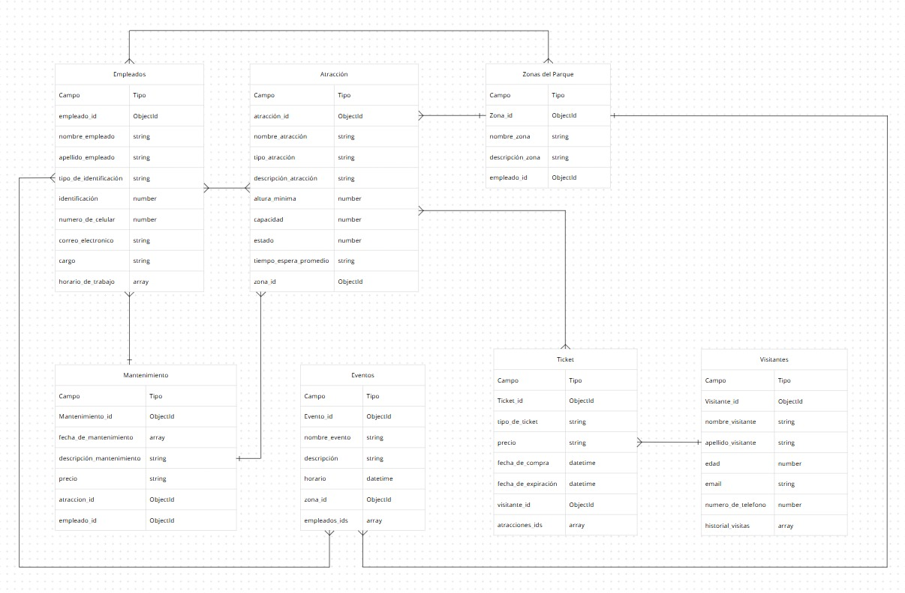

# Diseño de Base de Datos NoSQL para el Parque Nicole

## Integrantes

* Juan Jose Prada Contreras
* Victor Alejandro Pabon
* Breyner Fernando Pinto

## Introducción

El objetivo principal de este diseño es estructurar una base de datos NoSQL utilizando MongoDB para el parque de diversiones "Parque Nicole". Se optó por un enfoque de referencias (referencing) debido a que los documentos relacionados pueden ser cambiantes o extensos.

## Análisis de Entidades y Propuesta de Modelo de Datos

### Diagrama ER

### Atracciones

**Nombre de la Colección:** Atracciones.

**Atributos Propuestos:**

- _id: ObjectId
- nombre:string
- tipo: string
- descripción: string
- altura_minima: number
- capacidad: number
- estado: number
- tiempo_espera_promedio: string

**Relaciones:**

- Tickets *referencia* **muchos a muchos** *
- Empleados *referencia* **muchos a uno**
- Mantenimiento *referencia* **uno a muchos**

**Aplicación**

[{
  "_id": "72959c46be9c40a2a115bec0",
  "nombre_atracción": "Montaña Rusa",
  "tipo_atracción": "Extrema",
  "descripción_atracción": "Atracción con loopings",
  "altura_mínima": 140,
  "capacidad": 20,
  "estado": "Operativa",
  "tiempo_espera_promedio": "15 minutos",
  "zona_id": "9f54cfc13e3b47629a05b8a7"
}]

### Zonas del Parque

**Nombre de la Colección:** Zonas del Parque.

**Atributos Propuestos:**

- _id: ObjectId
- nombre: string
- descripción: string

**Relaciones:**

- Atracciones *referencia* **Muchos a uno**
- Empleados *referencia* **Muchos a uno**

**Estrategia de Relación:**
**Tipo De Relación:**
**Justificación:** 

**Aplicación**

[{
  "_id": "9f54cfc13e3b47629a05b8a7",
  "nombre_zona": "Zona Aventura",
  "descripcion_zona": "Zona con atracciones extremas",
  "empleado_id": "f39c52d73b294cffbdf178a3"
}]

### Visitantes

**Nombre de la colección:** Visitantes.

**Atributos Propuestos:**

- _id: ObjectId
- nombre: string
- apellido: string
- edad: number
- email: string
- numero_de_telefono: number
- historial_visitas: array {data time}

**Relaciones**

- Ticket *referencia* **muchos a uno**

**Estrategia de Relación:**
**Tipo De Relación:**
**Justificación:** 

**Aplicación**

[{
  "_id": "ee9da35a6f9046c18ca780e9",
  "nombre_visitante": "María",
  "apellido_visitante": "Gómez",
  "edad": 30,
  "email": "maria.gomez@email.com",
  "numero_de_telefono": 3001234567,
  "historial_visitas": []
  "tickets_id": "f39c52d73b294cffbdf178a3"
}]

### Tickets

**Nombre de la colección:** Tickets

**Atributos Propuestos**

- _id: ObjectId
- tipo_de_ticket: string
- precio: string
- fecha_de_compra: data time
- fecha_de_expiración: data time

**Relaciones**

- Visitante *referencia* **Uno a muchos**
- Atracciones *referencia* **Muchos a muchos**

**Estrategia de Relación:**
**Tipo De Relación:**
**Justificación:** 

**Aplicaciones**

[{
  "_id": "fdf840effbae4ac0964b6cdf",
  "tipo_de_ticket": "Día completo",
  "precio": "80000",
  "fecha_de_compra": "2025-06-10 10:30:00",
  "fecha_de_expiración": "2025-06-10 22:00:00",
  "visitante_id": "ee9da35a6f9046c18ca780e9",
  "atracciones_ids": [
    "72959c46be9c40a2a115bec0"
  ]
}]

### Empleados

**Nombre de la colección:** Empleados

**Atributos Propuestos:**

- _id: ObjectId
- nombre: string
- apellido: string
- tipo_de_identificación: string
- identificación: number
- numero_de_celular: number
- correo_electronico: string
- cargo: string
- horario_de_trabajo: array {data time}

**Relaciones**

- Atracciones *referencia* **muchos a muchos**
- Zonas del Parque *referencia* **uno a muchos**
- Mantenimiento *referencia* **muchos a muchos**

**Estrategia de Relación:**
**Tipo De Relación:**
**Justificación:** 

**Aplicaciones**

[{
  "_id": "f39c52d73b294cffbdf178a3",
  "nombre_empleado": "Carlos",
  "apellido_empleado": "Ramírez",
  "tipo_de_identificación": "CC",
  "identificación": 1234567890,
  "numero_de_celular": 3201234567,
  "correo_electronico": "carlos.ramirez@parque.com",
  "cargo": "Supervisor",
  "horario_de_trabajo": [
    "Lunes a Viernes",
    "8am - 5pm"
  ]
}]

### Eventos

**Nombre de la colección:** Eventos

**Atributos Propuestos**

- _id: ObjectId
- nombre_evento: string
- descripción_evento: string
- horario: data time

**Relaciones**

-Zonas del Parque *referencia* **uno a muchos**
-Empleados *referencia* **muchos a muchos**

**Estrategia de Relación:**
**Tipo De Relación:**
**Justificación:** 

**Aplicaciones**

[{
  "_id": "91b20d3da8fc40b7a8a66b85",
  "nombre_evento": "Festival de la Alegría",
  "descripción": "Evento familiar con shows y comidas",
  "horario": "2025-06-15 18:00:00",
  "zona_id": "9f54cfc13e3b47629a05b8a7",
  "empleados_ids": [
    "f39c52d73b294cffbdf178a3"
  ]
}]

### Mantenimiento

**Nombre de la colección:** Mantenimiento

**Atributos Propuestos**

- _id: ObjectId
- fecha_de_mantenimiento: array {data time}
- descripción_mantenimiento: string
- precio: string

**Relaciones**

- Empleado *referencia* **muchos a uno**
- Atracciónes *referencia* **muchos a uno**

**Aplicaciones**

[{
  "_id": "fab86ee4472045d0b344e3fa",
  "fecha_de_mantenimiento": [
    "2025-06-01 00:00:00"
  ],
  "descripción_mantenimiento": "Cambio de frenos y prueba de seguridad",
  "precio": "500000",
  "atraccion_id": "72959c46be9c40a2a115bec0",
  "empleado_id": "f39c52d73b294cffbdf178a3"
}] 